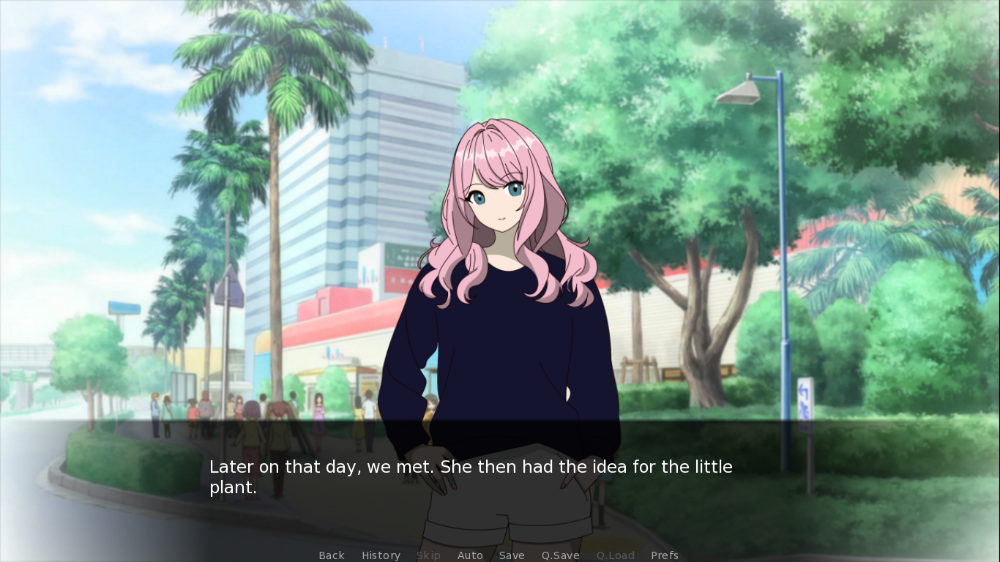
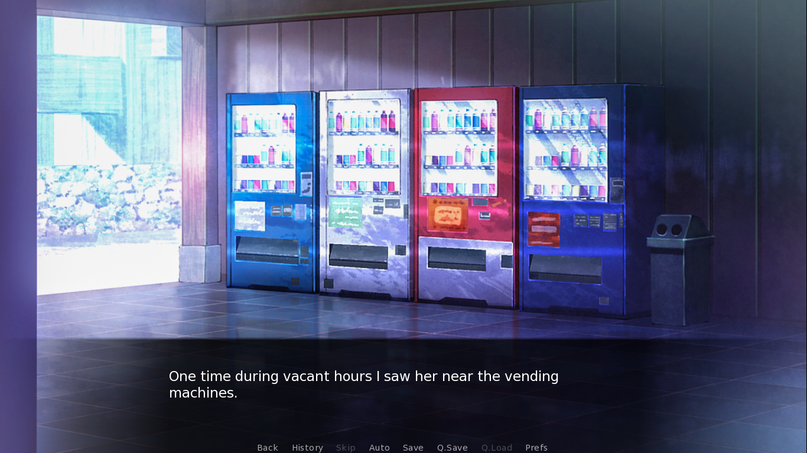
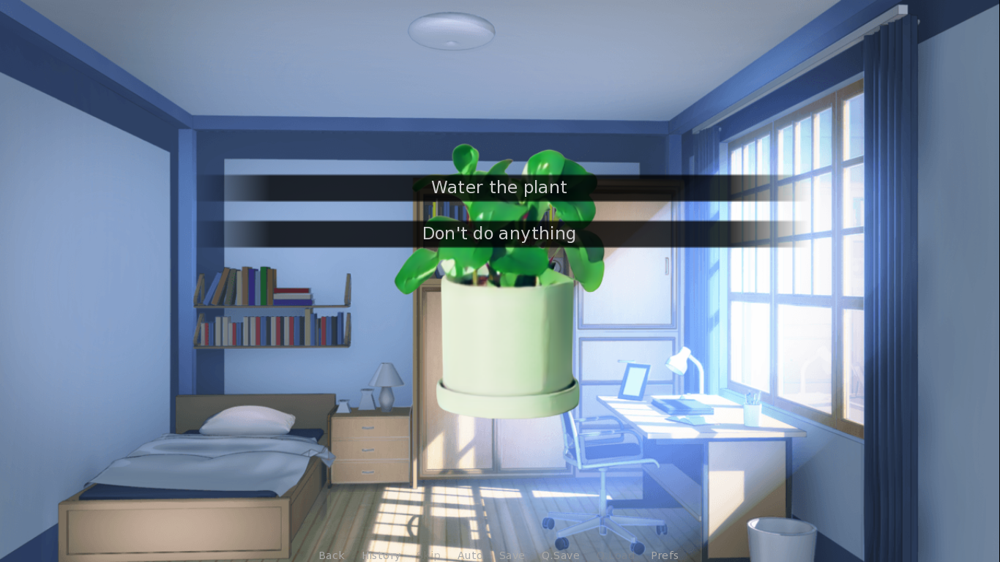

# Nurturing Love

Sylvia's Story is a visual novel created using the Ren'Py engine. It tells a heartfelt story about relationships, personal growth, and the choices that shape our lives. Players follow the protagonist's journey with Sylvia, making decisions that lead to one of several possible endings.

## 🖼️ Screenshots

### Sylvia

### Background Art

### Choices

## ✨ Features

- 📖 **Interactive Storytelling**: Make choices that influence the narrative and lead to different endings.
- 🎭 **Multiple Endings**: Explore four unique endings based on your decisions.
- 🖼️ **Dynamic Visuals**: Characters and scenes change as the story progresses.
- 💬 **Engaging Dialogue**: A touching story with meaningful conversations and emotional depth.

## 🚀 Installation Guide

1. Clone or download this repository.
2. Run `Test.exe` (Windows) or `Test.sh` (Linux/Mac) to start the game.
3. Follow the story and make choices to progress.
4. Replay the game to explore all possible endings.

## 📁 Project Structure

- `game/` - Main game files.
  - `script.rpy` - The main story script with branching logic.
  - `options.rpy` - Game configuration settings.
  - `screens.rpy` - Custom screens and UI elements.
- `renpy/` - Core Ren'Py engine files.
- `screenshots/` - Screenshots of the game for documentation.

## 📄 License

This project includes portions of the Ren'Py engine, which is licensed under various open-source licenses. See [LICENSE](renpy/LICENSE.txt) for details.

## 📝 Note

- This project was created as part of my Data Structure & Algorithm course during my 2nd year in college, and was submitted on June 8, 2023.
- Any resemblance to real persons, living or dead, is purely coincidental. 